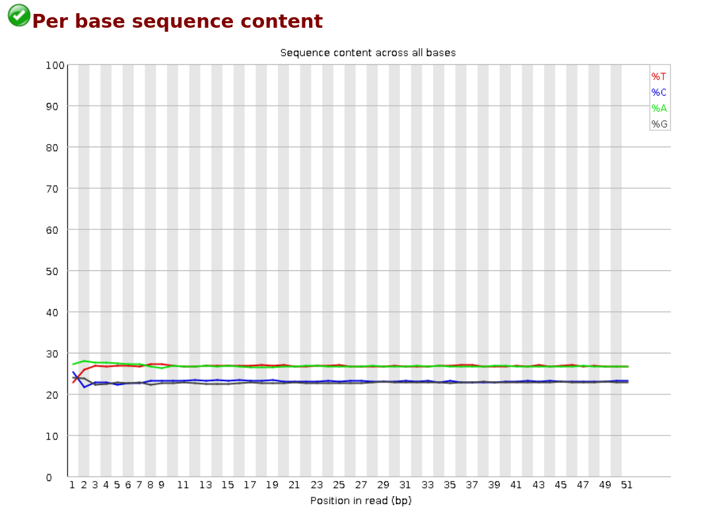
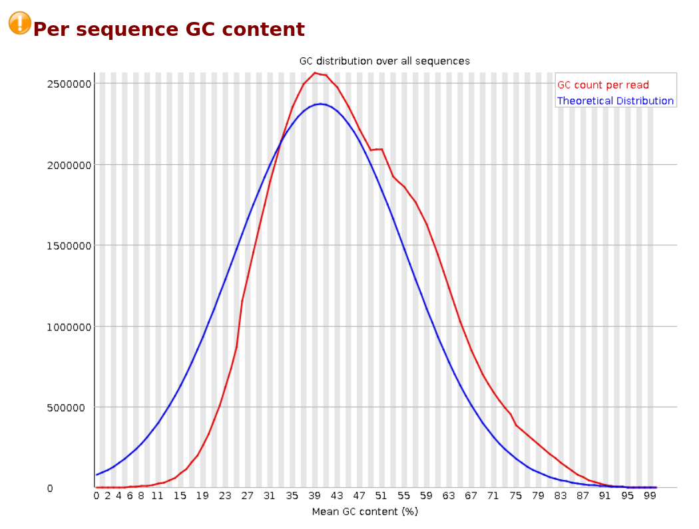

# Отчёт о выполненном задании

[Ссылка на Google Colab](https://colab.research.google.com/drive/1cAC4se9OW6VSqMbHgmRGf-tZW1UEKDTd?usp=sharing)

Клеточная линия | Гистоновая метка | Реплика 1 | Реплика 2 | Контроль
--- | --- | --- | --- | ---
A549 | H3K4me2 | ENCFF507YIE | ENCFF826KAA | ENCFF524OKJ

## Отчёты FastQC

Качество чтение хорошее, поэтому подрезание не потребовалось

### ENCFF507YIE

### ENCFF826KAA

### ENCFF524OKJ

## Таблица со статистикой

Образец | Общее количество чтений | Количество чтений выравненных уникально | Количество чтений выравненных неуникально | Количество ридов невыравненных
--- | --- | --- | --- | ---
ENCFF507YIE | 45551674 | 1869094 (4.10%) | 4867567 (10.69%) | 38815013 (85.21%)
ENCFF826KAA | 46522698 | 1746878 (3.75%) | 3986956 (8.57%)  | 40788864 (87.68%)
ENCFF524OKJ | 27267571 | 1119448 (4.11%) | 3052488 (11.19%) | 23095635 (84.70%)

## Диаграммы Эйлера-Венна

## ngs.plot графики

